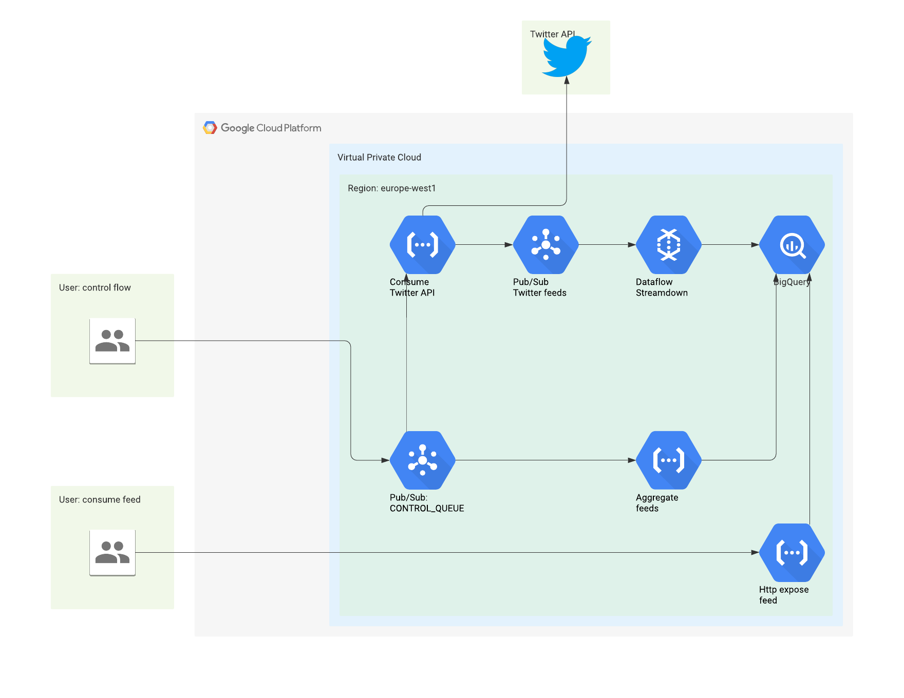

# Twitter-Aggregator.GoogleCloud - POC


## Prerequisites:
- GCP Account
- Billing Account
- gcloud CLI installed

## General info
Unfortunately I haven't found nice and easy way to include Dataflow resource into the deployment conf so that several additional commands are needed to deploy it.

## How to run

1) in cmd - ```gcloud projects create fedex-twitter --set-as-default```
2) Open "deployment.yaml" file and edit lines 81-86
2) in GCP Console - link project ```fedex-twitter``` to your valid billing account
4) in cmd - ```gcloud deployment-manager deployments create fedex-twitter-deployment --config deployment.yaml```
5) in cmd - ```gcloud dataflow jobs run pubsub2bq --gcs-location gs://dataflow-templates/latest/PubSub_Subscription_to_BigQuery --staging-location gs://feedex-tweets-bucket/staging --parameters inputSubscription=projects/fedex-twitter/subscriptions/pubsub2bq,outputTableSpec=fedex-twitter:tweetsds.tweets```
6) in cmd - ```gcloud functions call consume_feed --data "{\"data\":\"CONSUME_FEED\"}"```


